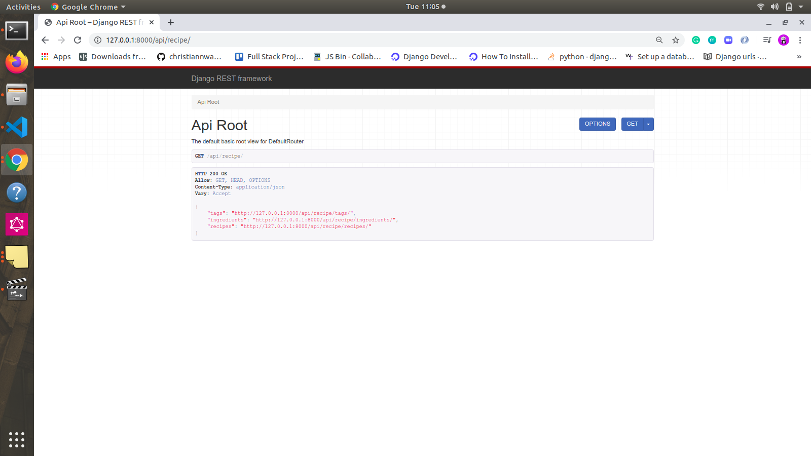

# Recipe  API
How to build a fully functioning REST API using:
   - Python
   - Django / Django-REST-Framework
   - Docker / Docker-Compose
   - Test Driven Development
### Getting started 
- A rest api in Django and DRF For a Recipe API
- Clone the project using git clone
- Enter the project directory cd app
- Visit http://localhost:8000/api/v1/docs to get started with the browsable api
#### Build containers
- docker-compose build

#### To start project, run:
- docker-compose up

